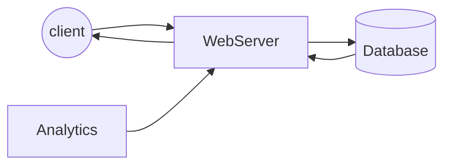
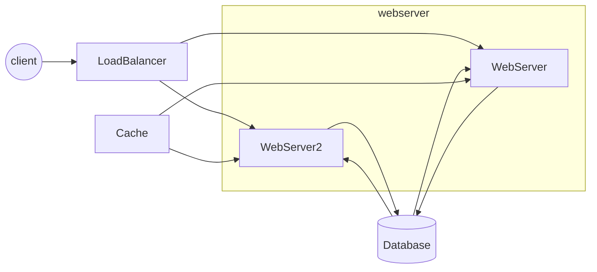
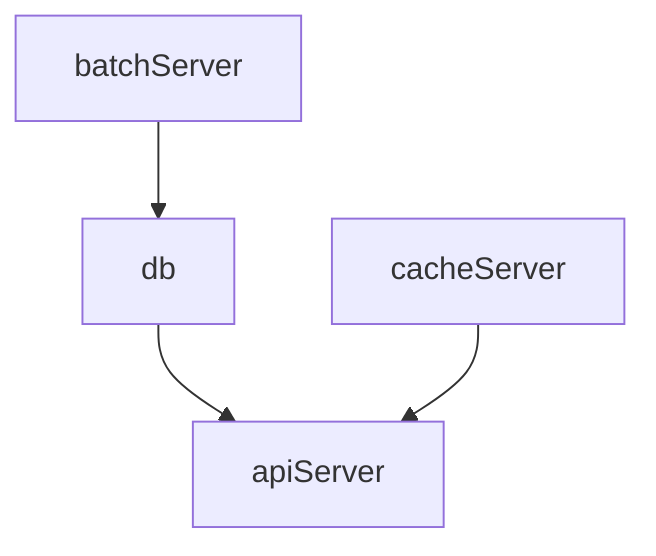

# System Design of Scaleble URL shortener service

source: https://medium.com/@sandeep4.verma/system-design-scalable-url-shortener-service-like-tinyurl-106f30f23a82

## Features

- URLの保持期間は？
- URLの長さはどれくらい？
- ユーザーがURLを作成できるようにするか、サービス側で自動生成するか。
- 生成したURLに対してどれくらいのトラフィックが生じるか？
- どのようなメトリクスを計測するべきか。

## System Design Goals

### 機能要件

- 長いURLを短いURLに変換することができる。
- 短縮URLをクリックするとオリジナルのURLにリダイレクトされる。
- 短縮URLの長さは可能な限り短くする。
- ユーザーは最大16文字を使ってカスタムの短縮URLを作成可能。
- 最もクリックされたリンクなどのメトリクスを計測している。
- 作成された短縮URLは一定期間、システムが保持する必要がある。

### 非機能要件

- サービスは常に稼働する必要がある。
- URLリダイレクトは常に高速であること（負荷のピークであっても）
- サードパーティとの統合のために、APIエンドポイントを公開できる。

## Traffic and System Capacity

### Traffic

- 200:1 = read/write ratio
- 1月のユニークな短縮URLの数 = 100M
- 1秒当たりの生成される短縮URLの数 ~ 40 URLs/second (30 days * 24 hours * 3600 seconds)
- 1秒当たりのリダイレクト数 = 40 URLs/s * 200 (read/write ratio) = 8000 URLs/s

### Storage

- サービスのライフタイム = 100y (100M urls per month)
- ライフタイム分のURL数 = 100 * 12 * 100M = 120B
- URL、作成日付などのデータオブジェクトを500byteとすると必要なストレージは 120B * 500 bytes = 60TB

### Memory

- Pareto Principle (20:80 lows)に基づいて、20%のデータをキャッシュすることで80%のリクエストをカバーできると仮定する。
- 8000 read request/seconds * 86400 seconds = 700M read request per day)
- キャッシュするデータ量は 700M * 0.2 * 500 bytes ~ 70GB

```
Shortened URLs generated: 40/s
Shortened URLs generated in 100 years: 120 billion
Total URL requests/redirections: 8000/s
Storage for 100 years: 60TB
Cache Memory: 70 GB
```

## High Level Design



### Problems with above design

- サーバーが一つしかないため、単一障害点（SPOF）となる。
- システムがスケールできない。
- 60TBは一つのDBでは賄いきれない。また、8000/sのリードリクエストを処理できない。

### To cater above limitations

- ロードバランサーを追加する。
- データベースをシャードして、巨大なデータを格納できるようにする。
- キャッシュを追加して、DBへの負荷を減らす。



## Algorithms REST Endpoints

```bash
create(long_url, api_key, custom_url)

POST
Request Body: `{url=long_url, custom_url (optional)}`
Return OK (200) with the generated `short_url` in data
```

```bash
get(short_url)
Return a http redirect response (302)
```

**Tips**

A 301 redirect means the page has permanently moved to a new location.
A 302 redirect means that the moves is only temporaly. <- こうすると、クライアントからのリダイレクトリクエストがバックエンドまで飛んでくるためメトリクスの計測が可能。

## Database Schema

**User table**
```bash
user_id: unique
name:
email:
creation_date
```

**URL table**

```bash
short_url:
original_url:
user_id:
```

## Shortening Algorithm

Candidates are as follows:

- URL Encoding
- URL Encoding with base62
- URL Encoding through md5
- Key generation service (KGS)

base64でエンコードする場合、`[0-9][a-z][A-Z]`、すなわち一文字当たり64通りで変換される。
7文字使えば、`64^7 ~ 3500B`になるため要件の120Bを満たす。
従って、７文字のbase64エンコーディングすれば良いことがわかる。

次に、このアルゴリズムを使ってどのようにユニークなエンコード結果を得るか考える。

### Method1: Random
最も単純な方法は、ランダムに生成してそれがDBになければ保存、既存の場合は再度生成を繰り返す方法。

### Method2: Base Conversion

もっと良い方法として、進数を変換させることでユニークはエンコード結果を得る方法がある。
具体的には、まずある十分に大きい10進数（64進数に変換した際に７桁あるもの）を用意する。
新しいURLが作成される度に、その10進数に1を加算した値を64進数に変換した結果をShort URLとする。
このようにしていけば、必ずユニークなショートURLが生成可能となる。

### Method3: MD5 hash

URL文字列をMDハッシュに変換し、変換結果の先頭７文字を用いる。
その7文字がすでに使用されている場合には次の7文字を用いる。
この操作を繰り返す。

### Method4: Key Generation Service (KGS)

シンプルに7文字の文字列（未使用）を生成し、保存しておく。
このようにすることで構造はずっとシンプルにすることが可能。

使用ずみ文字列テーブルと未使用のテーブルの2つを用意しておく。
また、常にメモリー状に未使用の文字列を持っておくことで高速なレスポンスを期待する。
さらに、使用と同時に最速で使用済みテーブルに格納されるために、同時接続があった場合にも対応できると考えられる。

単一障害点になりうるため常にレプリカを稼働させておく必要がある。

## Databases

- Relational databases
- NoSQL-style databases like BigTable and Cassandra

今回は、短縮URLが存在しない場合DBに格納することと、短縮URLがユニークである必要があるのでNoSQLライクなDBは不敵であると言える。

### Scaling

シャード技術を用いてスケーリングさせる。短縮URLのアルゴリズムごとにシャーディング戦略を立てることができる。

#### For method1: Random

短縮URLの7文字ハッシュをシャーディングキーに代用可能（ユニークなキーを元によしなにシャーディングをしてくれるMongoDBなどがあるっぽい）。
また、短縮URLをインデックスすることでより高速な読み取りを期待できる。

#### For method2: Base Conversion

新しい短縮URLごとに増えていく数字を使って、シャーディングができる。範囲指定する感じで。


## Cache

頻繁にアクセスされるURLはキャッシュしておく。

キャッシュに必要なデータ量は20％のリクエスト分のデータ。

キャッシュのポリシーはLeast Reacently Used（最も長い間参照されていないものから削除していく方法）が適している。

## Load Balancer

- クライアントとWebserverの間
- WebServerとDBサーバーの間
- WebServerとキャッシュサーバーの間

ロードバランスの方法もいくつかあるみたい。

## Customer provided Tiny URLs

8文字以上も英数字と一部の特殊文字で生成してもらうようにすればOK。

## Analytics

302レスポンスを返すので、バックエンドサーバーにリクエストが飛ぶ。これをKafkaなどに送信すればOKなんだね。

## 自分の考え

### システムが設計すべき事項・解決すべき問題・設計スコープ

要件
- 与えられたURLに対し、自分のドメインのURLを生成して割り当てる。
- すでに割り当て済みのURLがあった場合には、生成済みのURLを返す。
- 生成したURLにアクセスがあった場合に、登録された元のURLに対してリダイレクトする。
- 一定期間アクセスがなかったURLは自動で削除する。

### HLD



### 細部

#### Scaling

- ユーザー数・CPU使用割合に応じたAPIサーバーのスケーリング。
- データベースの量はそこまでいらない。ユーザー当たり、頻繁に短いURLを作成するケースは少ないと想定できるため。

#### Cacheing

- 直近アクセスがあったURLはキャッシュしておく。
