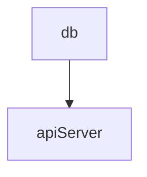

# System Design of Scaleble URL shortener service

source: https://medium.com/@sandeep4.verma/system-design-scalable-url-shortener-service-like-tinyurl-106f30f23a82

## 自分の考え

### システムが設計すべき事項・解決すべき問題・設計スコープ

要件
- 与えられたURLに対し、自分のドメインのURLを生成して割り当てる。
- すでに割り当て済みのURLがあった場合には、生成済みのURLを返す。
- 生成したURLにアクセスがあった場合に、登録された元のURLに対してリダイレクトする。
- 一定期間アクセスがなかったURLは自動で削除する。

### HLD

### 細部
