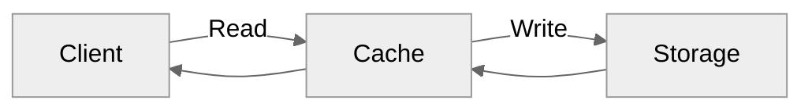
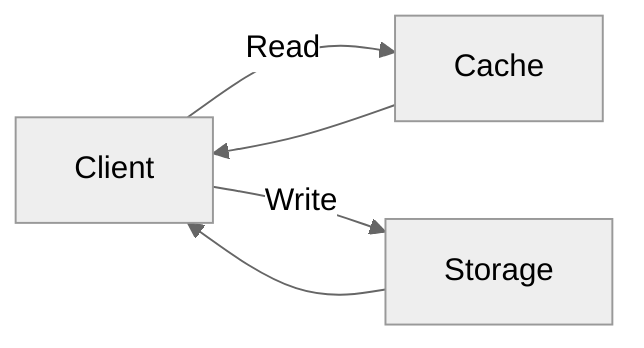
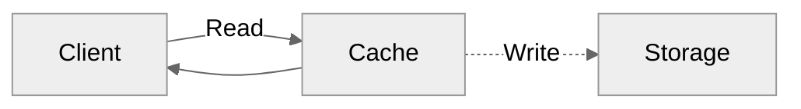
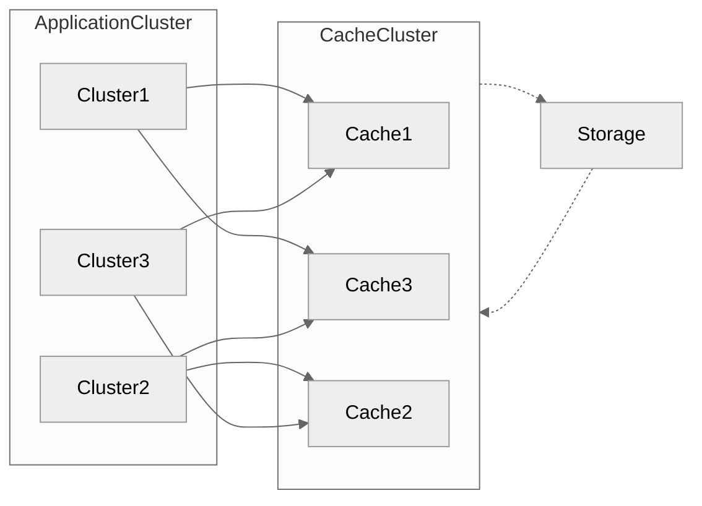
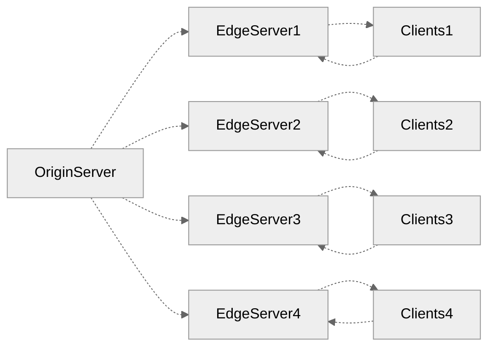

# System Design basics

From
[karanpratapsignh/system-design](https://github.com/karanpratapsingh/system-design)

## Cacheとは何のためにあるの？

相対的に時間がかかるストレージレイヤーへの直接的な読み取りを減らし、データ取り出し操作のパフォーマンスを向上させるため。

一時的なデータが保存されており、その正確性は担保されていないため、パフォーマンスとのトレードオフがある。

### Cacheにデータはどのように保存・読み取りされるのか？

L1, L2, L3 ... のように階層構造で保存場所が区切られている。 一般的に、上位レイヤー（L1 > L2 > L3）ほどデータ容量は大きくなる。

キャッシュのどこに保存されたか（メモリ上のアドレス）をタグとしてデータと共に保持しておく。

読み取り時にはタグを元に上位レイヤー（L1）から検索される。 どのレイヤーにもなければ、直接ストレージに読みに行く。その後、キャッシュに書き込まれる。

### Cache Hitとは？

キャッシュがメモリー内に存在し、読み取り要求に対して値を返すことができる場合のこと。

- Hot Cacheとは、可能な限り最も早い速度で値を読み取れるキャッシュのこと。L1に保存されているキャッシュ。
- Warm, Cool Cacheは読み取り速度がより遅いキャッシュ。L2,3に保存される。

### Cache missとは？

キャッシュが見つからない場合のこと。

### CacheデータとStorageデータをどのように同期させたらいいの？

Cache Invalidationはコンピュータシステムがキャッシュデータを有効か無効か判断し、取り除いたり上書きするプロセスのこと。

代表的な3パターンが挙げられる。

#### Write-through Cache

データがキャッシュに書き込まれると同時に、ストレージにも書き込まれる。

**Pros**: 読み取り速度が速い。キャッシュとストレージのデータ一貫性が取れる。

**Cons**: 書き込みのレイテンシが増加する。

#### Write-around Cache

書き込みはキャッシュを介さず、直接ストレージに対して行う。

**Pros**: レイテンシの改善（特に書き込み？）。

**Cons**: 直近に書き込んだデータの読み取り要求が発生し、結果的にレイテンシ悪化に繋がりやすい。

#### Write-back Cache

書き込みをキャッシュに対して行い、非同期でStorageに反映する。

**Pros**: 書き込みが大量に発生するアプリケーションのパフォーマンス改善を期待できる。

**Cons**: キャッシュサーバーに障害が発生して、データを失う危険性がある。

### Cacheがいっぱいになったらどうしたらいいの？

代表的なCache Evictionポリシーで定めている。

- First In First Out
- Last In First Out
- Least Recently Used
- Most Recently Used
- Least Frequently Used
- Random Replacement

### 分散キャッシュシステムとは？

複数アプリケーションサーバー（クライアント）とストレージの間に立って、共有されるキャッシュを分散キャッシュシステムと呼ぶ。

アプリケーションクラスターのノードに対してCacheを割り当てる。

より詳細なアーキテクチャを詰めると、ロードバランサーなどが必要になってくる。

### グローバルキャッシュシステムとは？

クラスター間で共有するキャッシュサーバー。

### キャッシュシステムのユースケースは？

- Database Caching
- Content Delivery Network
- Domain Name System Caching
- API Caching

### キャッシュを使わないほうが良いケースは？

- キャッシュを介したアクセスとデータストアへのアクセスにそこまで速度差がない場合。
- リクエストのランダム性が非常に高い場合。
- データストアのデータが頻繁に変わる場合。

### サービス・技術例

- Redis
- Memchached
- Amazon Elasticache
- Aerospike

## CDNとは何のためにあるの？

CDNとは、ネットワークとを介したコンテンツのを素早く行うために、地理的に工夫して配置されたサーバー群のこと。

- ネットワークを介したコンテンツの可用性・冗長性。
- 帯域コストの削減やセキュリティ向上。

### CDNの仕組みとは？

オリジンサーバー（コンテンツのオリジナルバージョンデータを持つ）とエッジサーバー（キャッシュサーバー）群から構成される。

クライアントは地理的に近いエッジサーバーに対してアクセスを投げることで、高速なレスポンスを期待できる。

### エッジサーバーのコンテンツをどうやって更新するか？

#### Push CDNs

オリジンサーバーのコンテンツが変更されたと同時に、エッジサーバー上のデータも変更する。

配信するコンテンツのより厳密な制御が可能。

#### Pull CDNs

エッジサーバーが自動でオリジンサーバーのコンテンツを読みに行く。

読み取りに行くタイミングはCDN上のキャッシュデータがExpiredした場合。

CDN上のキャッシュデータの更新はクライアントからオリジンサーバーへのリクエストで制御可能なため、メンテナンスが楽である。

配信されるコンテンツの厳密な制御はできない。

#### サービス例

- Amazon CloudFront
- Google Cloud CDN
- Cloudflare CDN
- Fastly
