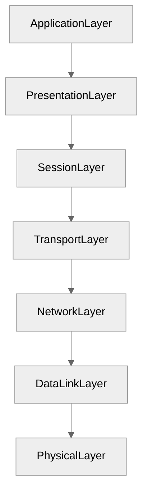
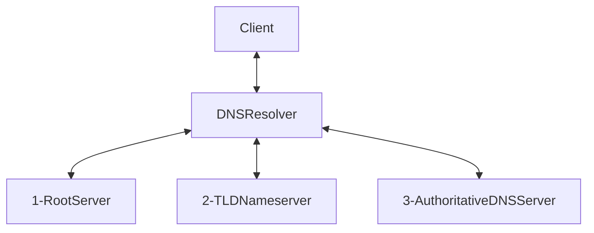

# System Design basics

From
[karanpratapsignh/system-design](https://github.com/karanpratapsingh/system-design)

## IPとは？

インターネットプロトコルの略称。デバイスがネットワーク（ローカルも含む）を介してやり取りするため。
IPアドレスはインターネットやローカルネットワーク上でデバイス固有の値をもつ。

### IPv4とIPv6の違い

IPv4: `e.g. 102.22.192.181` IPv6: `e.g. 2001:0db8:85a3:0000:0000:8a2e:0370:7334`

IPv4では数が足りなくなってきたため、IPv6が1999年に提案された。

### Public/Private/Static/Dynamic/ IP Addressの違い

Public IP Addressは全てのインターネット上で固有のIPアドレス。プロバイダが提供するものなど。

Private IP Addressは自分のネットワーク上で固有のIPアドレス。グローバルで固有ではない。

Static IP Addressは不変のIPアドレスで手動で作成されたIPアドレス。

Dynamic IP Addressは時間によって変化するIPアドレス。インターネット上で最も一般的なIPアドレス。価格も最も安い。

## OSI Modelとは？

OSIモデルとはOpen System Interactionの略称で、ネットワークを介して異なるシステム間で相互通信を行うための
概念・モデルのこと。一定の処理単位ごとに7つのレイヤーに分割して、それぞれのレイヤー同士の相互通信を行うモデル である。

### なぜOSIモデルが重要なのか？

- トラブルシューティングのしやすさと脅威の迅速な検知。
- 共通の通信仕様を定義することで、ネットワーク通信を伴うハードウェアの開発を推進させるため。
- セキュリティファーストな開発を重点とするため。
- 複雑な処理をよりシンプルな処理に分割するため。

### 7つのレイヤーについて

#### Application Layerの役割

ユーザーインターフェース。 ソフトウェアそのものではなく、HTTPやSMTPなどといった通信手順やデータ形式を決める役割を担う。

#### Presentation Layerの役割

Application Layerからのデータを適切なフォーマット（UTF-8）などに変換する（またはその逆）。またデータの暗号化も行う。

#### Session Layerの役割

異なるシステム間の通信の確立・維持・終了までの手順を規定している。

#### Transport Layerの役割

異なるシステム間がやり取りする際のエンドポイントとして機能する。
具体的には、データをセグメントに分割して送ったり、受け取ったセグメントデータを組み立てる役割を担う。

#### Network Layerの役割

セグメントデータをさらに細かいパケットと呼ばれる単位まで分割する/受け取ったパケットを組み立てる役割を担う。
また、ベストな転送経路を見つけることも行う。異なるシステムが同じネットワーク上にある場合、この層は必要ない。

#### DataLink Layerの役割

パケットをさらに細かいフレームと呼ばれる単位まで分割/組み立てる役割を担う。

#### Physical Layerの役割

ケーブルやスイッチなどデータ転送に関わる物理機器。また、データがビットに変換される層でもある。

## TCPとUDPの違い

通信方法が違います。TCPは相互通信が可能だと判断してから、データのやり取りを行う。さらにやり取りの際にエラーチェックなどが行われる。
一方でUDPは相互通信が可能かどうかチェックもいらず、データを送ることができる。エラーチェックなども行わない。

したがって、通信速度が異なります。ファイルの送信などデータの正確性が求められるケースでは、TCPが好まれる。リアルタイム性が求められる場合はUDPを使うことが多い。
一方で正確性はUDPが劣る。通信速度とデータの正確性のトレードオフ。

## DNSとは？

IPアドレス（記号）に対して、一定の規則に従う文字列を割り当てるためのシステム。

### どうやって文字列からIPアドレスを見つけるの？

1. クライアントがexample.comとWebブラウザに入力する。インターネットを介して、入力した内容（クエリ）がDNS Resolverに送られる。
2. クエリからDNS Root Nameserverを検索する。
3. DNS Root Nameserverに対して、クエリを送りTLD Name Serverを検索する。
4. TLD Name Serverに対してクエリを送り、Authoritative DNS Serverを検索する。
5. Authoritative DNS Serverにクエリに対応するIPアドレスがないか検索する。
6. クエリに対応するIPアドレスが見つかるまでAuthoritative DNS Serverを探す操作を繰り返す。
7. Authoritatieve DNS ServerからIPアドレスを取得し、Resolverがクライアントに返す。

### DNS Root Serverは何をやっているの？

`.com, .net, .org, etc.`などのドメイン名からTLDNameServerのIPアドレスのリストを返す。

### TLD Name Serverは何をやっているの？

TLD Name Serverが所有するDNSサーバーのIPアドレスを返す。

### Authoritative DNS Serverは何をやっているの？

example.comに対応するIPアドレスを探し、存在する場合は返す。

DNSリゾルバがすでにDNSレコードをキャッシュしている場合もあり、その場合はキャッシュからIPアドレスを返却することもある。

### ドメインのパーツごとの名前は？

`{subdomain}.{primary domain}.{top level domain}`

### DNSサービス

- Route53
- Cloudflare DNS
- Google Cloud DNS
- Azure DNS
- NS1
