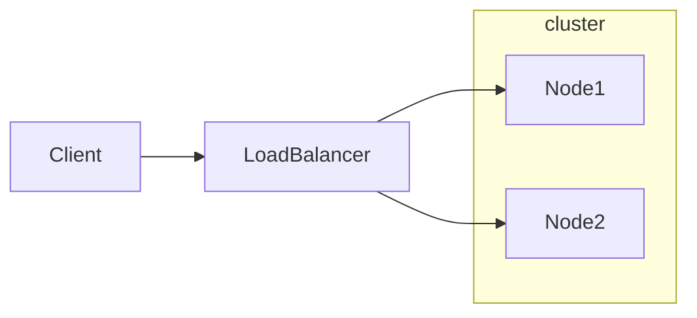
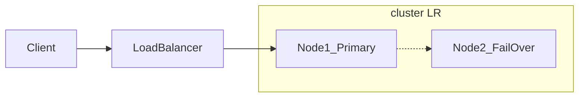

# System Design basics

From [karanpratapsignh/system-design](https://github.com/karanpratapsingh/system-design)

## なぜLoad Balancingが必要なのか？

- 膨大なトラフィックを、複数台のサーバーを使って効率的に処理するため。
- 単一障害点をなくし、可用性を向上させるため。

### どうやってトラフィックを分散させているのか？

- Host-based: ホスト名に基づいて分散させる方法。
- Path-based: URLに基づいて分散させる方法。
- Content-based: リクエストのメッセージ内容を元に分散させる方法。

### ロードバランサーはOSIモデルのどの層で行うべきか？

#### Network Layer

いわゆるL4ロードバランサーのこと。
OSIモデルの４層目にあたるネットワーク転送レイヤーにて、ネットワークに関する情報（IPアドレスなど）を用いて、ルーティングを行う。
この時点では、データの内容を解釈することはできないため、コンテンツベースのルーティングはできない。

e.g. CLB, NLB (AWS)

#### Application Layer

いわゆるL7ロードバランサーのこと。
OSIモデルの7層目に当たるアプリケーションレイヤーにて、コンテンツベース（クッキーなど）のルーティングを行う。
ロードバランサーを使ったセッションの維持はL7ロードバランサーじゃないとできない。

e.g. CLB, ALB (AWS)

### ロードバランサーにはどんな種類があるか？

#### Softwareタイプ

最も一般的なタイプ。NginXとか。

#### Hardwareタイプ

オンプレミスでデバイスを設置して使うタイプ。あまり聞かないけど

#### DNSタイプ

IPアドレスを返してそこへアクセスさせる方法。DNSは転送先の状態を確認しないため、不便。あまり使われていない。

### Routing Algorithms

- **Round-robin**: ローテーション方式で転送先を決める。
- **Weighted Round-robin**: サーバーの性能に応じて重み付けしてローテーションする方式。
- **Least Connections**: コネクションが少ないサーバーに優先的に転送する方式。
- **Lease Response Time**: レスポンスが早いサーバーに優先的に転送する方式。
- **Least Bandwidth**: トラフィックが少ないサーバーに優先的に転送する方式。
- **Hashing**: こちらが独自に定義したキーに応じて振り分ける方式(IPアドレスやリクエストURLなど)。

### ロードバランサーの冗長性（Redundancy）は大丈夫そう？

単一のロードバランサーは単一障害点になる。
クラスターモードでロードバランサーを運用し、本体が死んだら待機しているロードバランサーに切り替えるなどの対応が可能。

### ロードバランサーの要件とは？

- トラフィックに応じてサーバーリソースのオートスケールが可能であること。
- セッションを保持できること（同じユーザーのアクセスは同じサーバーに転送する）。
- サーバーのヘルスチェックが可能であること。
- Webソケットのようなパーシステントコネクションが可能であること。
- TLSやSSLのような暗号化処理を行うことができること。
- 接続元の認証が可能であること。
- レスポンスを圧縮できること。
- L7ロードバランサーなどは、キャッシュが可能であること。
- ロギングが可能であること。
- リクエストトレースが可能であること。リクエストごとにユニークなIDを振り分けてログをとる。
- リダイレクトが可能であること。
- 固定レスポンスができること（エラーメッセージ的な）。

### サービス例

- Amazon ELB
- Azure Load Balancing
- GCP Load Balancing
- Nginx

## なぜClusteringが必要なのか？

複数のコンピュータリソースにまたがって処理を分散的に行うことで、より効率的に、スピーディに処理を行うため。

一台のノードがリーダー的な役割を果たし、他のノードのエントリーポイントとして動作していることが一般的。
リーダーノードが処理を他ノードに分散して行わせたり、処理結果を集約してユーザーに返す処理を行う。

### クラスターの種類

- **Highly available or fail-over** (クラスターノードに障害が発生した場合に他のノードがサービスを提供する。Kubernetes的な？)
- **ロードバランシング**
- **ハイパフォーマンスコンピューティング**

### High Availavilityのクラスター設定例

#### active-active

#### active-passive

### クラスタリングを用いたコンピューティングのメリットとは？

- 高可用性
- スケーラビリティ
- パフォーマンス
- コスト効率

### クラスタリングを用いる場合のデメリットは？

- 複雑性のメンテナンスの難しさ。

### サービス例

- Containers (e.g. Kubernetes, Amazon ECS)
- Databases (e.g. Cassandra, MongoDB)
- Cashe (e.g. Redis)
