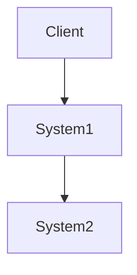
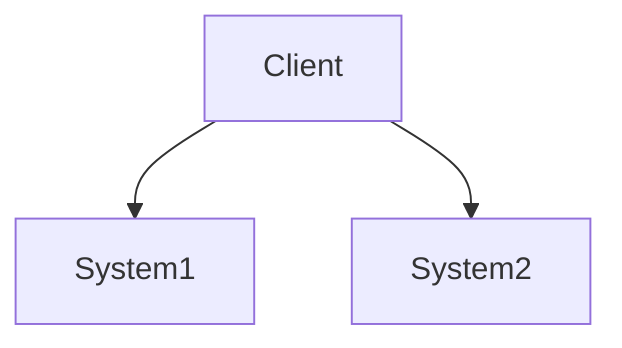

# System Design basics

From
[karanpratapsignh/system-design](https://github.com/karanpratapsingh/system-design)

## Proxyは何をするためのもの？

Clientとバックエンドサーバーの間に立って、ユーザーのリクエストをフィルタリングしたり、ログを取ったり、
リクエストのトランスフォーム（ヘッダーの追加・削除、暗号化・復号、圧縮...etc）

### Forward Proxyとは？

クライアントとインターネットの間に立って、クライアントのリクエストをもとにインターネットとのやり取りを代わりに行うProxy。
セキュリティ目的で、社内インターネットに用いられるパターンなどがある。

#### Pros

- 特定のコンテンツへのアクセスをブロックする。
- クライアントの地理情報を基にアクセスを制御する。
- プロバイダの匿名化ができる。
- ブラウザの制限を回避する。

#### Cons

- プロキシサーバーに残っているキャッシュ情報などから情報漏洩するパターンがある。

### Reverse Proxyとは？

インターネットとサーバーとの間に立って、クライアントからのリクエストをインターセプトする。

#### Pros

- セキュリティ向上
- キャッシュとして使える
- SSL暗号化通信が可能
- ロードバランサとして使える。
- 拡張性・柔軟性向上。

#### Cons

- 単一障害点になりやすい。

### Load BalancerとReverse Proxyの違いとは？

Load Balancerは複数のサーバーを管理するためのものであるが、Reverse Proxyは一つのサーバーに対しても有用である。

## Availability（高可用性）とは？

システムの稼働率を基に図る指標。稼働率は全体の稼働時間のうち、正常に稼働していた時間の割合を用いる。

システムが直列に繋がれている場合と並列に稼働している場合では、稼働率の計算が異なる。

稼働率 = (System1の稼働率) * （System2の稼動率）

稼動率 = 1 - （System1のダウン率）*（System2のダウン率）

### Reliability（信頼性）とAvailabilityの違いは？

Reliabilityはシステムそのものの壊れにくさのこと。Reliabilityが高ければAvailabilityも高くなる。
一方でAvailabilityが高くてもReliabilityは高くなるわけではない。

### Fault Tolerance（耐障害性）とAvailabilityの違いは？

耐障害性は、障害発生時にどれだけ短い時間で立て直せるかを表している。例えば、冗長性を確保することで、耐障害性は向上する。

## Scalabilityとは？

Scalabilityとはシステムが需要に応じてリソースの追加・削減を行えるかどうかの指標のことである。

### Vertical ScalingとHorizoontal Scalingの違いとは？

Vertival Scaling (scaling up)
は、システム単体の能力を上げることでスケールする方法。Apexでいうと、自分がどんどん上達するイメージ。

Horizontal Scaling (scaling out)はシステムの数を増やすことでスケールする方法。
Apexでいうと、本来敵同士のパーティが手を組んで順位を上げていくチーミングにあたる。

## Storageとは？

システムがデータを一時的・永続的に保持するためのもの。

### RAIDはなぜ必要なの？

RAID（Redundant Array of Independent Disk）とはハードディスクドライブの故障からデータを保護するために
同じデータを複数のハードディスクやSSDなどに保存することである。

冗長性を高めるためのいくつかの段階がある。

### Volumesとは何？

diskやTape上に確保されたストレージ領域のこと。storageと同義であるが、一つのDiskに複数のVolumeを確保することができる点が特徴としてある。

### File Storageとは何？

データをファイルとして階層構造的に保存するストレージのこと。いつも触ってるやつ。

e.g. Amazon EFS, Google Cloud FileStore

### Block Storageとは何？

データをブロック（ボリューム）単位で保存するストレージのこと。一つの大きなデータをブロックに分けて保存する。 HDDやUSBメモリーはこの形式で保存されている。

PCなどOSを介してBlockStorageにアクセスする際には、ブロックストレージ上にファイルシステムを作成しアクセスしている。

e.g. Amazon EBS

### Object Storageとは何？

データはフラットに管理される。ファイルストレージに比べて、オブジェクトに対する保存期間やコピー回数など多くのメタデータを付与できる。

またインデックスを作成して、大規模データでも素早い検索を可能としている。

e.g. Amazon S3

### NASとは？

Network Attached
Storageとはネットワークに接続されたストレージデバイスのことで、容量の追加・削減やデータ取り出し書き込みをネットワークを介して行える。

### HDFSとは？

Hadoop Distributed File Systemは分散ファイルシステムのこと。
Fault-Tolerantでコストのかからないハードウェア上に構築することを目的に作られている。

大きなサイズのファイルをブロックごとに分割して保存している。また、そのレプリカを別のハードウェアに保存することで高いFault-Tolerantを実現している。
